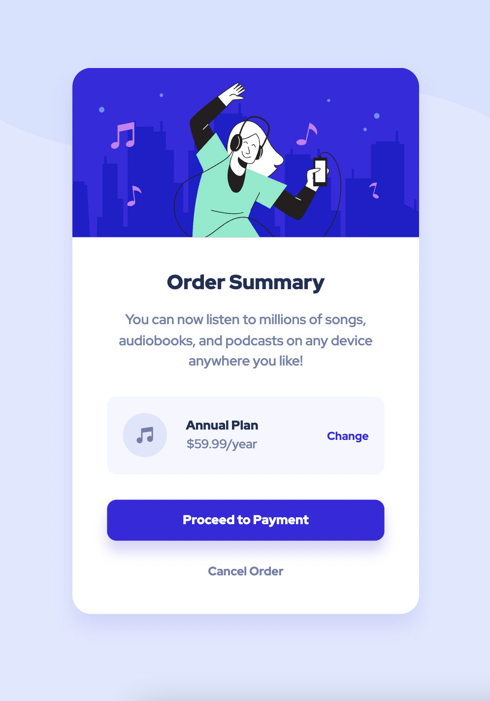

# Frontend Mentor - Order summary card solution

This is a solution to the [Order summary card challenge on Frontend Mentor](https://www.frontendmentor.io/challenges/order-summary-component-QlPmajDUj). 

## Table of contents

- [Overview](#overview)
  - [The challenge](#the-challenge)
  - [Screenshot](#screenshot)
  - [Links](#links)
- [My process](#my-process)
  - [Built with](#built-with)
  - [What I learned](#what-i-learned)
  - [Continued development](#continued-development)
  - [Useful resources](#useful-resources)
- [Author](#author)

## Overview

### The challenge

Users should be able to:

- See hover states for interactive elements

### Screenshot



### Links

- Solution URL: This is my [solution](https://www.frontendmentor.io/solutions/order-summary-component-challenge-hub-H0vr9g0hw)
- Live Site URL: This is the [live site](https://your-live-site-url.com)

## My process

### Built with

- Semantic HTML5 markup
- CSS custom properties
- Flexbox
- Mobile-first workflow

### What I learned

One of the major learnings I discovered while building this website was that using a 'container wrapper' is not always necessary to acheive the design (as shown below). I realised this when looking at other challengers' solutions on [Frontend Mentor] (https://www.frontendmentor.io/challenges) and comparing it with my own solution. While it is one way of solving this challenge, I had faced a few design issues and found this use of a wrapper counter-productive.

```html
<!-- Current html -->
<div class="container">
   ...
</div>

<!-- As opposed to using the code snippet below -->
<div class="container">
  <div class="container-wrapper">
     ...
  </div>
</div>
```

Furthermore, I had also discovered a way of making elements responsive without the need of '@media query'. I had initially tried to make the page responsive enough for the order summary component to shrink in size in order to fit smaller viewport width. However, this caused more design issues as it meant that I would need to rely on @media queries and edit on most css rulesets for different screen sizes. Instead of going through all the trouble, I made the component have a fixed width value with equal margins on all sides, as opposed to using soft-coded values, in order to make it stay in the center of the page without shrinking and to avoid overflowing elements. I also used the scale() function to ensure that the component is seen well as it was initially too large.

```css
/* Current CSS */
.container {
  transform: scale(0.8);
  margin: auto;
  width: 550px;
}

/* As opposed to using the code snippet below */
.container {
  width: 80%;
}
```

### Continued development

Areas I would like to continue refining in the future include:
- CSS Grid
- Flexbox
- CSS variables and functions

### Useful resources

- [Stackoverflow](https://stackoverflow.com/) - This helped me investigate how to effectively implement certain css propeties, such as transition.

- [MDN Web Docs](https://developer.mozilla.org/en-US/) - This is an amazing website which helped me further understand certain concepts.

- [Frontend Mentor] (https://www.frontendmentor.io/challenges) - This website is where I found this challenge. It's a great resources for those who want to challenge themselves to different coding tasks. In this case, I chose this challenge which helps build confidence in building layouts.

## Author

- Frontend Mentor - [@coder-txane](https://www.frontendmentor.io/profile/coder-txane)
